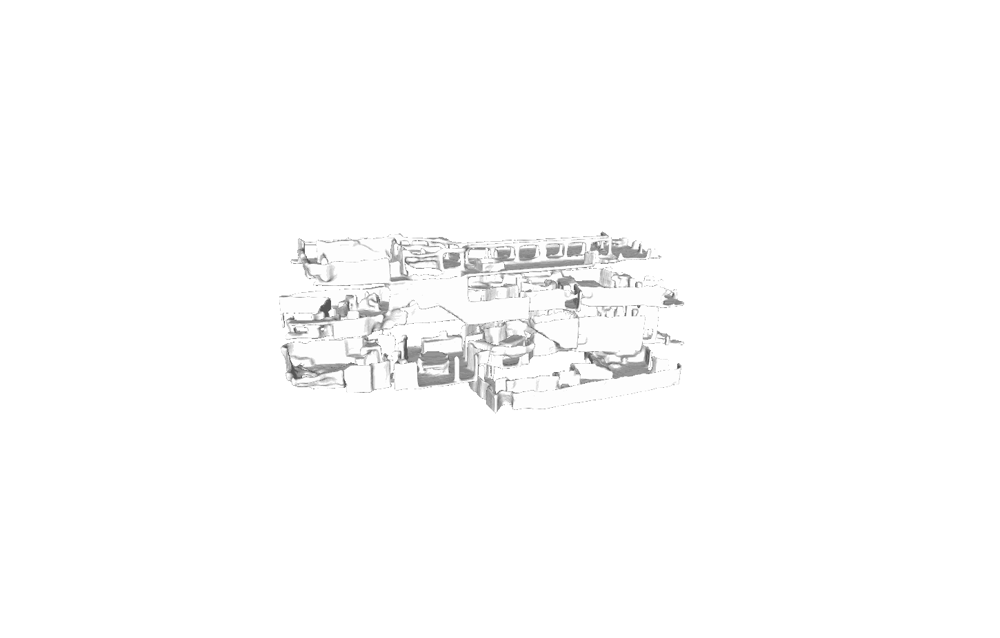

# Sign-Agnostic Convolutional Occupancy Networks
[**Paper**](https://arxiv.org/abs/2105.03582) | [**Supplementary**](https://arxiv.org/abs/2105.03582) | [**Video**]() | [**Teaser Video**]() | [**Project Page**]() <br>

<div style="text-align: center">

</div>

This repository contains the implementation of the paper:

SA-ConvONet: Sign-Agnostic Optimization of Convolutional Occupancy Network
**ICCV 2021 (Oral)**  

If you find our code or paper useful, please consider citing
```bibtex
@inproceedings{tang2021sign,
  title={SA-ConvONet: Sign-Agnostic Optimization of Convolutional Occupancy Networks},
  author={Tang, Jiapeng and Lei, Jiabao and Xu, Dan and Ma, Feiying and Jia, Kui and Zhang, Lei},
  booktitle={Proceedings of the IEEE/CVF International Conference on Computer Vision},
  year={2021}
}
```
Contact [Jiapeng Tang](mailto:tangjiapengtjp@gmail.com) for questions, comments and reporting bugs.


## Installation
First you have to make sure that you have all dependencies in place.
The simplest way to do so, is to use [anaconda](https://www.anaconda.com/). 

You can create an anaconda environment called `sa_conet` using
```
conda env create -f environment.yaml
conda activate sa_conet
```
**Note**: you might need to install **torch-scatter** mannually following [the official instruction](https://github.com/rusty1s/pytorch_scatter#pytorch-140):
```
pip install torch-scatter==2.0.4 -f https://pytorch-geometric.com/whl/torch-1.4.0+cu101.html
```

Next, compile the extension modules.
You can do this via
```
python setup.py build_ext --inplace
```

## Demo
First, run the script to get the demo data:
```
bash scripts/download_demo_data.sh
```

### Reconstruct Large-Scale Matterport3D Scene
You can now quickly test our code on the real-world scene shown in the teaser. To this end, simply run:
```
python scripts/dataset_matterport/make_cropscene_dataset2.py --in_folder data/demo/Matterport3D_processed --out_folder data/demo/Matterport3D_processed_normalize --do_norm
python generate_optim_largescene.py configs/pointcloud_crop/demo_matterport.yaml
```
This script should create a folder `out/demo_matterport/generation` where the output meshes and input point cloud are stored.

**Note**: This experiment corresponds to our **fully convolutional model**, which we train only on the small crops from our synthetic room dataset. This model can be directly applied to large-scale real-world scenes with real units and generate meshes in a sliding-window manner, as shown in the [teaser](media/teaser_matterport.gif). More details can be found in section D.1 of our [supplementary material](https://arxiv.org/abs/2105.03582). For training, you can use the script `pointcloud_crop/room_grid64.yaml`.


### Reconstruct Synthetic Indoor Scene
You can also test on our synthetic room dataset by running: 
```
python generate_optim_scene.py configs/pointcloud/demo_syn_room.yaml
```


## Reconstruct ShapeNet Object

You can also test on the ShapeNet dataset by running:
```
python generate_optim_object.py configs/pointcloud/demo_shapenet.yaml --this file needs to be created.
```

## Dataset

To evaluate a pretrained model or train a new model from scratch, you have to obtain the respective dataset.
In this paper, we consider 4 different datasets:

### ShapeNet
You can download the dataset (73.4 GB) by running the [script](https://github.com/autonomousvision/occupancy_networks#preprocessed-data) from Occupancy Networks. After, you should have the dataset in `data/ShapeNet` folder.

### Synthetic Indoor Scene Dataset
For scene-level reconstruction, we use a synthetic dataset of 5000
scenes with multiple objects from ShapeNet (chair, sofa, lamp, cabinet, table). There are also ground planes and randomly sampled walls.

You can download the preprocessed data (144 GB) by ConvONet using

```
bash scripts/download_data.sh
```

This script should download and unpack the data automatically into the `data/synthetic_room_dataset` folder.  
**Note**: The **point-wise semantic labels** are also provided in the dataset, which might be useful.


Alternatively, you can also preprocess the dataset yourself.
To this end, you can:
* download the ShapeNet dataset as described above.
* check `scripts/dataset_synthetic_room/build_dataset.py`, modify the path and run the code.

### Matterport3D
Download Matterport3D dataset from [the official website](https://niessner.github.io/Matterport/). And then, use `scripts/dataset_matterport/build_dataset.py` to preprocess one of your favorite scenes. Put the processed data into `data/Matterport3D_processed` folder.

### ScanNet
Download ScanNet v2 data from the [official ScanNet website](https://github.com/ScanNet/ScanNet).
Then, you can preprocess data with:
`scripts/dataset_scannet/build_dataset.py` and put into `data/ScanNet` folder.  
**Note**: Currently, the preprocess script normalizes ScanNet data to a unit cube for the comparison shown in the paper, but you can easily adapt the code to produce data with real-world metric. You can then use our fully convolutional model to run evaluation in a sliding-window manner.

## Usage
When you have installed all binary dependencies and obtained the preprocessed data, you are ready to perform sign-agnostic optimzation, run the pre-trained models, and train new models from scratch.

### Mesh Generation for ConvOnet
To generate meshes using a pre-trained model, use
```
python generate.py CONFIG.yaml
```
where you replace `CONFIG.yaml` with the correct config file.

**Use pre-trained models**
The easiest way is to use a pre-trained model. You can do this by using one of the config files under the `pretrained` folders.

For example, for 3D reconstruction from noisy point cloud with our 3-plane model on the synthetic room dataset, you can simply run:
```
python generate.py configs/pointcloud/pretrained/room_3plane.yaml
```
The script will automatically download the pretrained model and run the mesh generation. You can find the outputs in the `out/.../generation_pretrained` folders

Note that the config files are only for generation, not for training new models: when these configs are used for training, the model will be trained from scratch, but during inference our code will still use the pretrained model.

The provided following pretrained models are:
```
pointcloud/shapenet_3plane.pt
pointcloud/room_grid64.pt
pointcloud_crop/room_grid64.pt
```

### Sign-Agnostic Optimization of ConvONet
Before the sign-agnostic, test-time optimization on the Matterport3D dataset, we firstly run the below script to preprocess the testset.
```
python scripts/dataset_matterport/make_cropscene_dataset.py --in_folder $in_folder --out_folder $out_folder --do_norm
```
Please specify the in_folder and out_folder.

To perform sign-agnostic, test-time optimization for more accurate surface mesh generation using a pretrained model, use
```
python generate_optim_object.py configs/pointcloud/test_optim/shapenet_3plane.yaml
python generate_optim_scene.py configs/pointcloud/test_optim/room_grid64.yaml
python generate_optim_scene.py configs/pointcloud/test_optim/room_grid64_scannet.yaml
python generate_optim_largescene.py configs/pointcloud_crop/test_optim/room_grid64.yaml
```


### Evaluation
For evaluation of the models, we provide the scripts `eval_meshes.py` and `eval_meshes_optim.py`. You can run it using:
```
python eval_meshes.py CONFIG.yaml
python eval_meshes_optim.py CONFIG.yaml
```
The scripts takes the meshes generated in the previous step and evaluates them using a standardized protocol. The output will be written to `.pkl/.csv` files in the corresponding generation folder which can be processed using [pandas](https://pandas.pydata.org/).

### Training
Finally, to pretrain a new network from scratch, run:
```
python train.py CONFIG.yaml
```
For available training options, please take a look at `configs/default.yaml`.

## Acknowledgements
Most of the code is borrowed from [ConvONet](https://github.com/autonomousvision/convolutional_occupancy_networks). We thank Songyou Peng for his great works.
